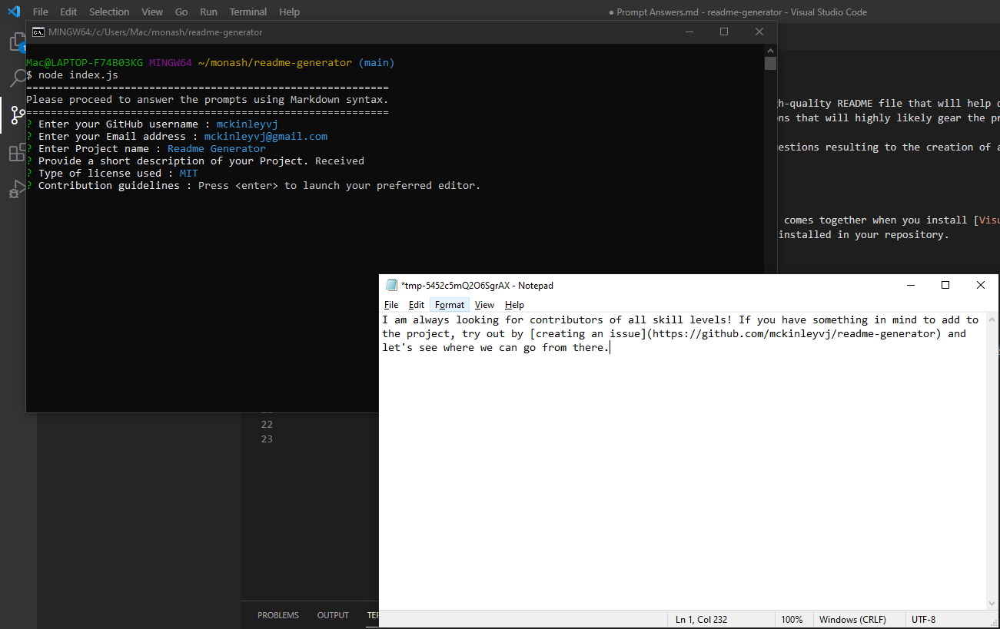
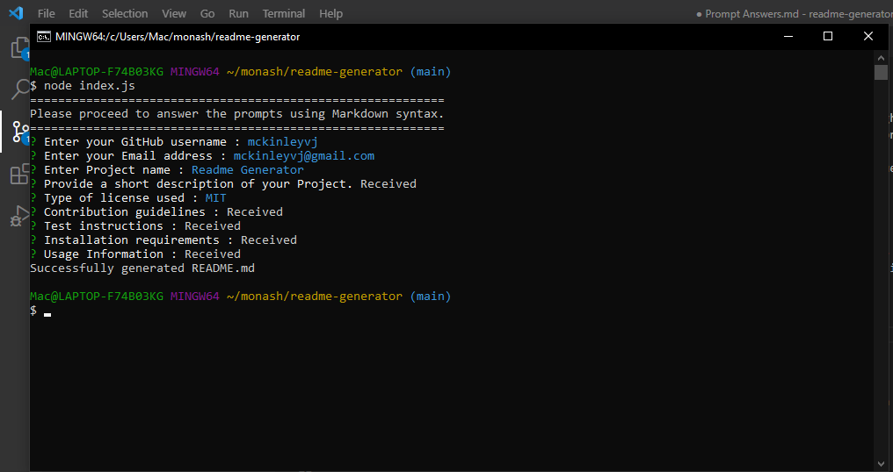
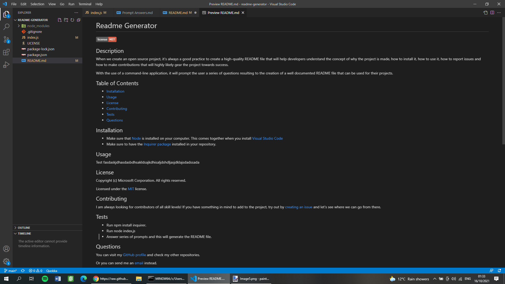

  # ✨Readme Generator
  [](https://choosealicense.com/licenses/mit)

  ## Description
  When we create an open source project or repository, it's always a good practice to create a high-quality <kbd>README</kbd> file that will help developers understand the concept of the purpose of the project, installation steps, usage, how to report issues and how other developers could contribute towards the success of the project.

This project uses a command-line application, it will prompt the user a series of questions resulting to the creation of a well documented <kbd>README</kbd> file that can be used for their projects/repositories.

  ## Table of Contents
  - [Installation](#installation)
  - [Usage](#usage)
  - [License](#license)
  - [Contributing](#contributing)
  - [Tests](#tests)
  - [Questions](#questions)

  ## Installation
  Lets check if the following packages are installed.

1. <kbd>npm</kbd> package

```bash
npm -v || npm -version
```

2. <kbd>node</kbd> package. Use the latest version or a version higher than 14.0.0

```bash
npm install n -g || npm install v16.0.0 (Specific version)
```

3. <kbd>inquirer</kbd> package. This will provide ease to the process of prompting questions, parsing answers and validating answers.

```bash
npm install inquirer
```

  <p align="right">(<a href="#top">back to top</a>)</p>

  ## Usage
  -   This project is solely used for generating a README for projects.
-   This project does not collect any information from user except descriptive texts for their projects/repositories.
-   This project is open source and is available to all developers that finds interest to enhancing features by raising [an issue](https://github.com/mckinleyvj/readme-generator/issues) or simply by [contacting me](#questions).

  <p align="right">(<a href="#top">back to top</a>)</p>

  ## License

  Copyright (c) Microsoft Corporation. All rights reserved.

  Licensed under the [mit](LICENSE) license.

  <p align="right">(<a href="#top">back to top</a>)</p>
  
  ## Contributing
  I am always looking for contributors of all skill levels! If you have something in mind to add to the project, try out by [creating an issue](https://github.com/mckinleyvj/readme-generator/issues) and let's see where we can go from there.
  
  <p align="right">(<a href="#top">back to top</a>)</p>

  ## Tests
  -   User will have to invoke the following command to run the application.
```bash
node index.js
```


-   Most of the descriptive prompts will open an editor for the user to keyin then must save it to be received by the application.
    

-   User selects a license for the application.
    

-   More prompts with editor.
    

-   Upon completion, a message will tell the user that the README is generated successfully.
    

-   The result of the generator
    

  <p align="right">(<a href="#top">back to top</a>)</p>
  
  ## Questions
  
  Visit my [GitHub profile](https://github.com/mckinleyvj) for more information about me and my other repositories.

  You can also send me an <a href="mailto:mckinleyvj@gmail.com?">email</a> to know more information.

  <p align="right">(<a href="#top">back to top</a>)</p>
  
  